# JurisOne: flow diagrams

| Version | Date | What changed | Requested by |
|---|---|---|---|
| 1.0 | 2026-10-23 | Initial version | Owner |

The document version is not the app version. Update the affected diagram in the same pull request as any change of a flow, and raise the version.
The diagrams are Mermaid and render on GitHub and in the IDE. Each one says who (role or system) does what, in order, with decisions and error paths. Requirement ids (FR-...) refer to `FRD-JurisOne.md`. The JurisTrack link has its own diagram in `FLOW-JurisTrack-JurisOne-Connection.md`.

Contents: 1 System overview, 2 Sign-in and session, 3 Roles and permissions, 4 Onboarding of an employee, 5 Employee status, 6 Attendance, 7 Regularization, 8 Leave, 9 Payroll and payslip, 10 Tax declaration and proofs, 11 Policies and the gate, 12 Announcements, assets and letters, 13 Tasks (create and assign, status workflow, comments and mentions, due and extra reminders, project access), 14 Subscription expiry and read-only, 15 Audit write path, 16 Notifications and language, 17 JurisTrack placeholder.

---

## 1. System overview

What it shows: the parts of the system and how a browser request reaches the data (FR-TEN-1, section 2 of the FRD).

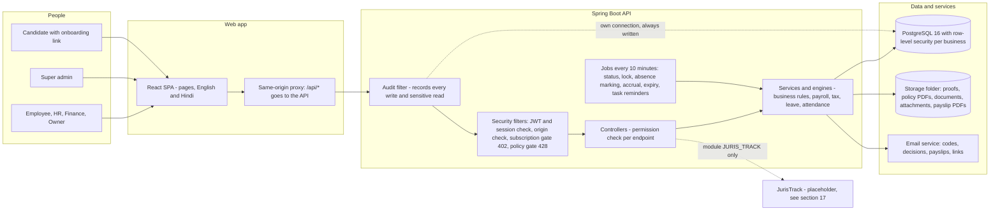
```mermaid
flowchart LR
    subgraph Users["People"]
        EMP["Employee, HR, Finance, Owner"]
        SUP["Super admin"]
        CAN["Candidate with onboarding link"]
    end
    subgraph Web["Web app"]
        SPA["React SPA - pages, English and Hindi"]
        PROXY["Same-origin proxy: /api/* goes to the API"]
    end
    subgraph Api["Spring Boot API"]
        AUD["Audit filter - records every write and sensitive read"]
        SEC["Security filters: JWT and session check, origin check, subscription gate 402, policy gate 428"]
        CTL["Controllers - permission check per endpoint"]
        SVC["Services and engines - business rules, payroll, tax, leave, attendance"]
        JOBS["Jobs every 10 minutes: status, lock, absence marking, accrual, expiry, task reminders"]
    end
    subgraph Data["Data and services"]
        PG[("PostgreSQL 16 with row-level security per business")]
        FILES[("Storage folder: proofs, policy PDFs, documents, attachments, payslip PDFs")]
        MAIL["Email service: codes, decisions, payslips, links"]
    end
    EMP --> SPA
    SUP --> SPA
    CAN --> SPA
    SPA --> PROXY
    PROXY --> AUD
    AUD --> SEC
    SEC --> CTL
    CTL --> SVC
    SVC --> PG
    SVC --> FILES
    SVC --> MAIL
    JOBS --> SVC
    AUD -. "own connection, always written" .-> PG
    JT["JurisTrack - placeholder, see section 17"]
    CTL -. "module JURIS_TRACK only" .-> JT
```

---

## 2. Sign-in by emailed code, session refresh and 401 handling

What it shows: how a person signs in with a one-time code, how the 5-minute access token is renewed silently, and what happens when the session is gone (FR-AUTH-1 to FR-AUTH-10).

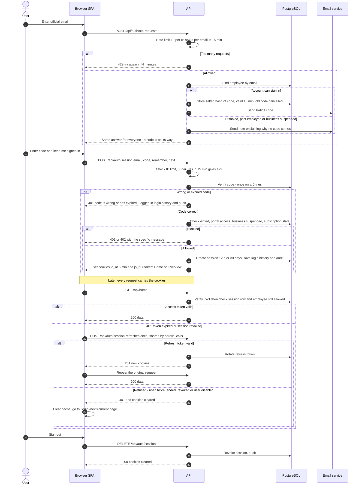
```mermaid
sequenceDiagram
    autonumber
    actor U as User
    participant B as Browser SPA
    participant A as API
    participant DB as PostgreSQL
    participant M as Email service

    U->>B: Enter official email
    B->>A: POST /api/auth/otp-requests
    A->>A: Rate limit 10 per IP and 5 per email in 15 min
    alt Too many requests
        A-->>B: 429 try again in N minutes
    else Allowed
        A->>DB: Find employee by email
        alt Account can sign in
            A->>DB: Store salted hash of code, valid 10 min, old code cancelled
            A->>M: Send 6-digit code
        else Disabled, past employee or business suspended
            A->>M: Send note explaining why no code comes
        end
        A-->>B: Same answer for everyone - a code is on its way
    end
    U->>B: Enter code and keep me signed in
    B->>A: POST /api/auth/session email, code, remember, next
    A->>A: Check IP limit, 30 failures in 15 min gives 429
    A->>DB: Verify code - once only, 5 tries
    alt Wrong or expired code
        A-->>B: 401 code is wrong or has expired - logged in login history and audit
    else Code correct
        A->>DB: Check exited, portal access, business suspended, subscription state
        alt Blocked
            A-->>B: 401 or 402 with the specific message
        else Allowed
            A->>DB: Create session 12 h or 30 days, save login history and audit
            A-->>B: Set cookies jo_at 5 min and jo_rt, redirect Home or Overview
        end
    end
    Note over B,A: Later, every request carries the cookies
    B->>A: GET /api/home
    A->>DB: Verify JWT then check session row and employee still allowed
    alt Access token valid
        A-->>B: 200 data
    else 401 token expired or session revoked
        B->>A: POST /api/auth/session-refreshes once, shared by parallel calls
        alt Refresh token valid
            A->>DB: Rotate refresh token
            A-->>B: 201 new cookies
            B->>A: Repeat the original request
            A-->>B: 200 data
        else Refused - used twice, ended, revoked or user disabled
            A-->>B: 401 and cookies cleared
            B->>B: Clear cache, go to /login?next=current page
        end
    end
    U->>B: Sign out
    B->>A: DELETE /api/auth/session
    A->>DB: Revoke session, audit
    A-->>B: 200 cookies cleared
```

---

## 3. Roles and permissions

What it shows: who defines roles, how a business gets them, and how a permission decides a page or an API call (FR-ROLE-1 to FR-ROLE-6).

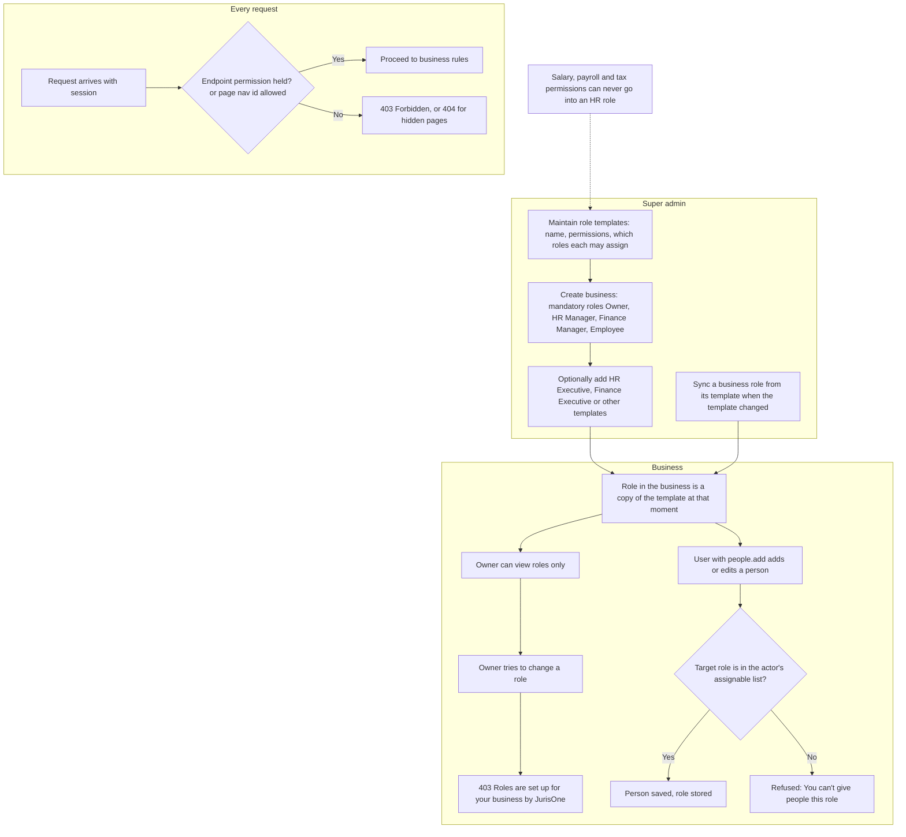
```mermaid
flowchart TD
    subgraph SA["Super admin"]
        T1["Maintain role templates: name, permissions, which roles each may assign"]
        T2["Create business: mandatory roles Owner, HR Manager, Finance Manager, Employee"]
        T3["Optionally add HR Executive, Finance Executive or other templates"]
        T4["Sync a business role from its template when the template changed"]
    end
    subgraph BIZ["Business"]
        R1["Role in the business is a copy of the template at that moment"]
        OW["Owner can view roles only"]
        OWA["Owner tries to change a role"]
        REF1["403 Roles are set up for your business by JurisOne"]
        ADD["User with people.add adds or edits a person"]
        CHK{"Target role is in the actor's assignable list?"}
        OK["Person saved, role stored"]
        REF2["Refused: You can't give people this role"]
    end
    subgraph REQ["Every request"]
        Q1["Request arrives with session"]
        Q2{"Endpoint permission held? or page nav id allowed"}
        Q3["Proceed to business rules"]
        Q4["403 Forbidden, or 404 for hidden pages"]
    end
    T1 --> T2 --> T3 --> R1
    T4 --> R1
    R1 --> OW --> OWA --> REF1
    R1 --> ADD --> CHK
    CHK -->|Yes| OK
    CHK -->|No| REF2
    Q1 --> Q2
    Q2 -->|Yes| Q3
    Q2 -->|No| Q4
    HRSAL["Salary, payroll and tax permissions can never go into an HR role"] -.-> T1
```

---

## 4. Onboarding of an employee

What it shows: the swimlane flow from HR inviting a candidate to the new employee's first sign-in, with the send-back and error paths (FR-ONB-1 to FR-ONB-5, FR-PEO-7).

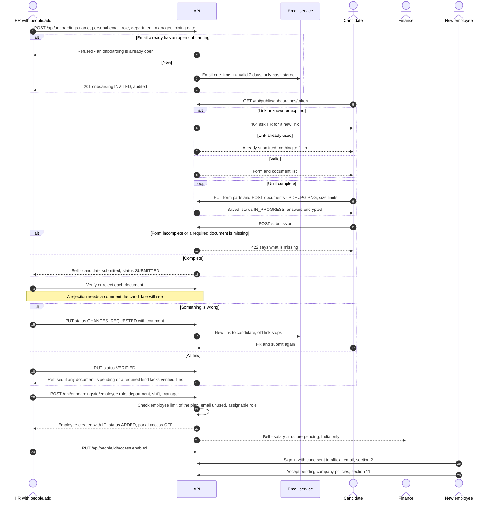
```mermaid
sequenceDiagram
    autonumber
    actor HR as HR with people.add
    participant API as API
    participant M as Email service
    actor C as Candidate
    actor FIN as Finance
    actor E as New employee

    HR->>API: POST /api/onboardings name, personal email, role, department, manager, joining date
    alt Email already has an open onboarding
        API-->>HR: Refused - an onboarding is already open
    else New
        API->>M: Email one-time link valid 7 days, only hash stored
        API-->>HR: 201 onboarding INVITED, audited
    end
    C->>API: GET /api/public/onboardings/token
    alt Link unknown or expired
        API-->>C: 404 ask HR for a new link
    else Link already used
        API-->>C: Already submitted, nothing to fill in
    else Valid
        API-->>C: Form and document list
    end
    loop Until complete
        C->>API: PUT form parts and POST documents - PDF JPG PNG, size limits
        API-->>C: Saved, status IN_PROGRESS, answers encrypted
    end
    C->>API: POST submission
    alt Form incomplete or a required document is missing
        API-->>C: 422 says what is missing
    else Complete
        API-->>HR: Bell - candidate submitted, status SUBMITTED
    end
    HR->>API: Verify or reject each document
    Note over HR,API: A rejection needs a comment the candidate will see
    alt Something is wrong
        HR->>API: PUT status CHANGES_REQUESTED with comment
        API->>M: New link to candidate, old link stops
        C->>API: Fix and submit again
    else All fine
        HR->>API: PUT status VERIFIED
        API-->>HR: Refused if any document is pending or a required kind lacks verified files
    end
    HR->>API: POST /api/onboardings/id/employee role, department, shift, manager
    API->>API: Check employee limit of the plan, email unused, assignable role
    API-->>HR: Employee created with ID, status ADDED, portal access OFF
    API-->>FIN: Bell - salary structure pending, India only
    HR->>API: PUT /api/people/id/access enabled
    E->>API: Sign in with code sent to official email, section 2
    E->>API: Accept pending company policies, section 11
```

---

## 5. Employee status lifecycle

What it shows: how a person moves between statuses, by the daily job or by a person (FR-PEO-4 to FR-PEO-6).

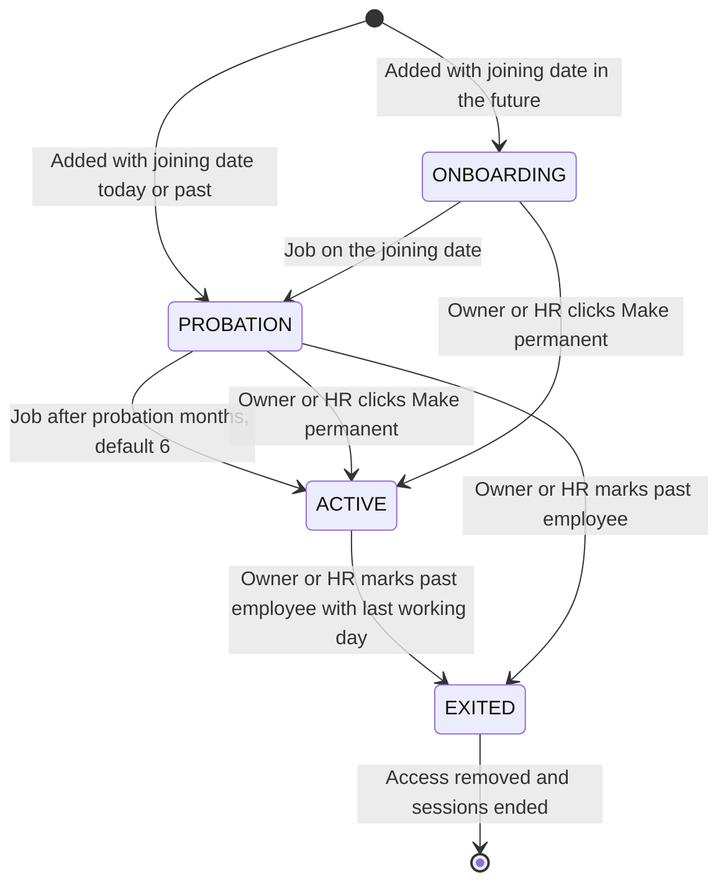
```mermaid
stateDiagram-v2
    [*] --> ONBOARDING: Added with joining date in the future
    [*] --> PROBATION: Added with joining date today or past
    ONBOARDING --> PROBATION: Job on the joining date
    PROBATION --> ACTIVE: Job after probation months, default 6
    PROBATION --> ACTIVE: Owner or HR clicks Make permanent
    ONBOARDING --> ACTIVE: Owner or HR clicks Make permanent
    ACTIVE --> EXITED: Owner or HR marks past employee with last working day
    PROBATION --> EXITED: Owner or HR marks past employee
    EXITED --> [*]: Access removed and sessions ended
```

---

## 6. Attendance: check-in, day status, lock

What it shows: how a punch becomes a day status, how late marks and LOP arise, and when the month locks (FR-ATT-1 to FR-ATT-4).

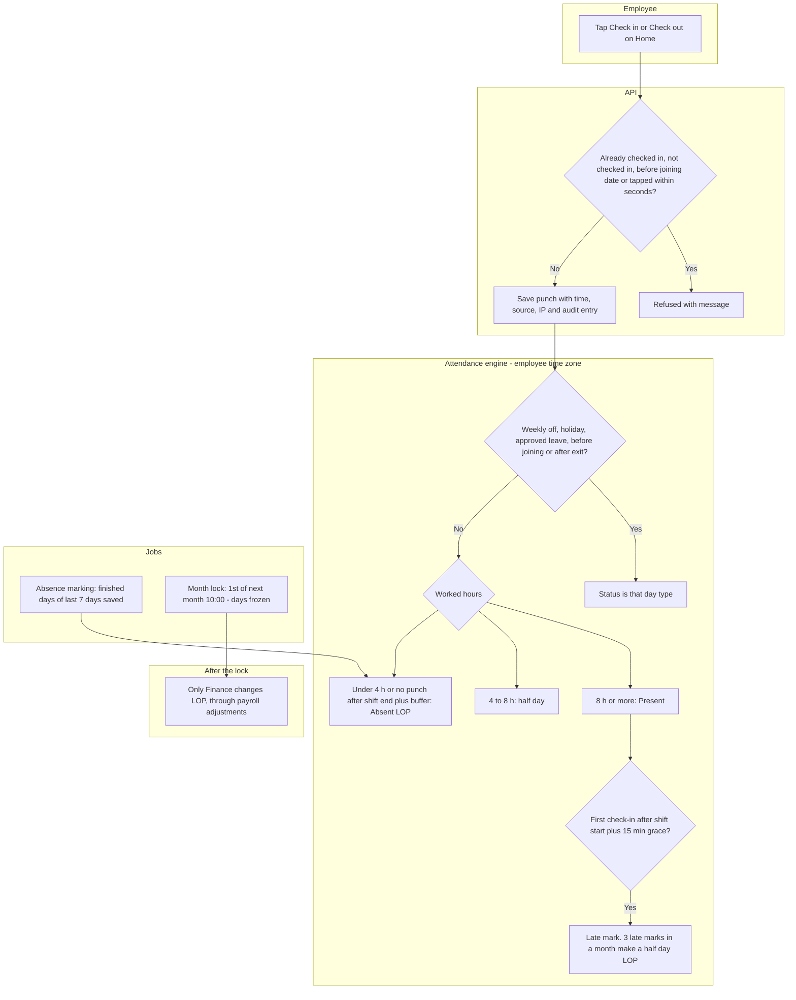
```mermaid
flowchart TD
    subgraph EMP["Employee"]
        P1["Tap Check in or Check out on Home"]
    end
    subgraph API["API"]
        V1{"Already checked in, not checked in, before joining date or tapped within seconds?"}
        E1["Refused with message"]
        V2["Save punch with time, source, IP and audit entry"]
    end
    subgraph ENG["Attendance engine - employee time zone"]
        D1{"Weekly off, holiday, approved leave, before joining or after exit?"}
        D2["Status is that day type"]
        D3{"Worked hours"}
        D4["8 h or more: Present"]
        D5["4 to 8 h: half day"]
        D6["Under 4 h or no punch after shift end plus buffer: Absent LOP"]
        L1{"First check-in after shift start plus 15 min grace?"}
        L2["Late mark. 3 late marks in a month make a half day LOP"]
    end
    subgraph JOB["Jobs"]
        J1["Absence marking: finished days of last 7 days saved"]
        J2["Month lock: 1st of next month 10:00 - days frozen"]
    end
    subgraph FIN["After the lock"]
        F1["Only Finance changes LOP, through payroll adjustments"]
    end
    P1 --> V1
    V1 -->|Yes| E1
    V1 -->|No| V2
    V2 --> D1
    D1 -->|Yes| D2
    D1 -->|No| D3
    D3 --> D4
    D3 --> D5
    D3 --> D6
    D4 --> L1
    L1 -->|Yes| L2
    J1 --> D6
    J2 --> F1
```

---

## 7. Attendance regularization with approval

What it shows: an employee asks to fix a day, the first approver decides, and the effect on attendance and comp-off (FR-REG-1 to FR-REG-4).

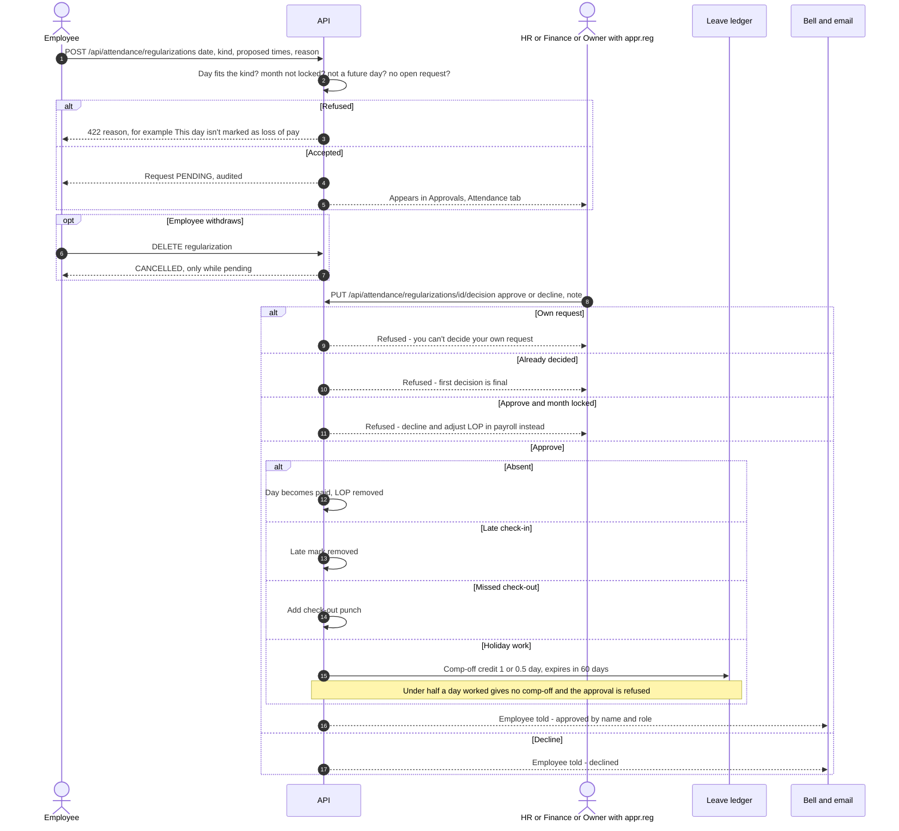
```mermaid
sequenceDiagram
    autonumber
    actor E as Employee
    participant API as API
    actor AP as HR or Finance or Owner with appr.reg
    participant L as Leave ledger
    participant N as Bell and email

    E->>API: POST /api/attendance/regularizations date, kind, proposed times, reason
    API->>API: Day fits the kind? month not locked? not a future day? no open request?
    alt Refused
        API-->>E: 422 reason, for example This day isn't marked as loss of pay
    else Accepted
        API-->>E: Request PENDING, audited
        API-->>AP: Appears in Approvals, Attendance tab
    end
    opt Employee withdraws
        E->>API: DELETE regularization
        API-->>E: CANCELLED, only while pending
    end
    AP->>API: PUT /api/attendance/regularizations/id/decision approve or decline, note
    alt Own request
        API-->>AP: Refused - you can't decide your own request
    else Already decided
        API-->>AP: Refused - first decision is final
    else Approve and month locked
        API-->>AP: Refused - decline and adjust LOP in payroll instead
    else Approve
        alt Absent
            API->>API: Day becomes paid, LOP removed
        else Late check-in
            API->>API: Late mark removed
        else Missed check-out
            API->>API: Add check-out punch
        else Holiday work
            API->>L: Comp-off credit 1 or 0.5 day, expires in 60 days
            Note over API,L: Under half a day worked gives no comp-off and the approval is refused
        end
        API-->>N: Employee told - approved by name and role
    else Decline
        API-->>N: Employee told - declined
    end
```

---

## 8. Leave request, approval and balance

What it shows: apply with a live preview, the approval by HR, how the ledger and the LOP split are written, and the monthly accrual (FR-LEV-1 to FR-LEV-6).

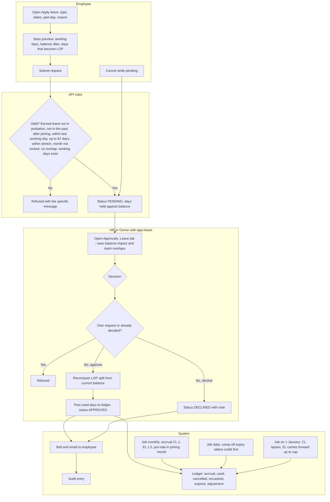
```mermaid
flowchart TD
    subgraph EMP["Employee"]
        A1["Open Apply leave: type, dates, part-day, reason"]
        A2["Sees preview: working days, balance after, days that become LOP"]
        A3["Submit request"]
        A4["Cancel while pending"]
    end
    subgraph API["API rules"]
        R1{"Valid? Earned leave not in probation, not in the past, after joining, within last working day, up to 62 days, within stretch, month not locked, no overlap, working days exist"}
        RE["Refused with the specific message"]
        R2["Status PENDING, days held against balance"]
    end
    subgraph HRL["HR or Owner with appr.leave"]
        H1["Open Approvals, Leave tab - sees balance impact and team overlaps"]
        H2{"Decision"}
        H3{"Own request or already decided?"}
        H4["Refused"]
        H5["Recompute LOP split from current balance"]
        H6["Post used days to ledger, status APPROVED"]
        H7["Status DECLINED with note"]
    end
    subgraph SYS["System"]
        S1["Bell and email to employee"]
        S2["Audit entry"]
        S3["Job monthly: accrual CL 1, EL 1.5, pro-rata in joining month"]
        S4["Job daily: comp-off expiry oldest credit first"]
        S5["Job on 1 January: CL lapses, EL carries forward up to cap"]
        S6["Ledger: accrual, used, cancelled, encashed, expired, adjustment"]
    end
    A1 --> A2 --> A3 --> R1
    R1 -->|No| RE
    R1 -->|Yes| R2
    A4 --> R2
    R2 --> H1 --> H2
    H2 --> H3
    H3 -->|Yes| H4
    H3 -->|No, approve| H5 --> H6 --> S1
    H3 -->|No, decline| H7 --> S1
    H6 --> S6
    S3 --> S6
    S4 --> S6
    S5 --> S6
    S1 --> S2
```

---

## 9. Payroll run and payslip

What it shows: from attendance lock to published payslips, who may edit and who may close, and what is frozen (FR-STR-1, FR-PAY-1 to FR-PAY-6, FR-SLIP-1).

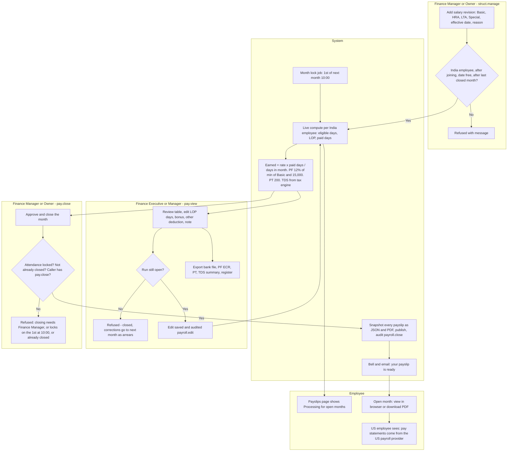
```mermaid
flowchart TD
    subgraph FMG["Finance Manager or Owner - struct.manage"]
        S1["Add salary revision: Basic, HRA, LTA, Special, effective date, reason"]
        S2{"India employee, after joining, date free, after last closed month?"}
        S3["Refused with message"]
    end
    subgraph SYS["System"]
        J1["Month lock job: 1st of next month 10:00"]
        C1["Live compute per India employee: eligible days, LOP, paid days"]
        C2["Earned = rate x paid days / days in month. PF 12% of min of Basic and 15,000. PT 200. TDS from tax engine"]
        K1["Snapshot every payslip as JSON and PDF, publish, audit payroll.close"]
        K2["Bell and email: your payslip is ready"]
    end
    subgraph FEX["Finance Executive or Manager - pay.view"]
        E1["Review table, edit LOP days, bonus, other deduction, note"]
        E2{"Run still open?"}
        E3["Refused - closed, corrections go to next month as arrears"]
        E4["Edit saved and audited payroll.edit"]
        X1["Export bank file, PF ECR, PT, TDS summary, register"]
    end
    subgraph CLS["Finance Manager or Owner - pay.close"]
        P1["Approve and close the month"]
        P2{"Attendance locked? Not already closed? Caller has pay.close?"}
        P3["Refused: closing needs Finance Manager, or locks on the 1st at 10:00, or already closed"]
    end
    subgraph EMP["Employee"]
        Y1["Payslips page shows Processing for open months"]
        Y2["Open month: view in browser or download PDF"]
        Y3["US employee sees: pay statements come from the US payroll provider"]
    end
    S1 --> S2
    S2 -->|No| S3
    S2 -->|Yes| C1
    J1 --> C1
    C1 --> C2 --> E1 --> E2
    E2 -->|No| E3
    E2 -->|Yes| E4 --> C1
    E1 --> X1
    C2 --> P1 --> P2
    P2 -->|No| P3
    P2 -->|Yes| K1 --> K2 --> Y2
    C1 --> Y1
    Y2 --> Y3
```

---

## 10. Tax declaration and proof verification

What it shows: the employee's regime choice and declarations, Finance's verification, and how only approved amounts lower TDS (FR-TAX-1 to FR-TAX-9).

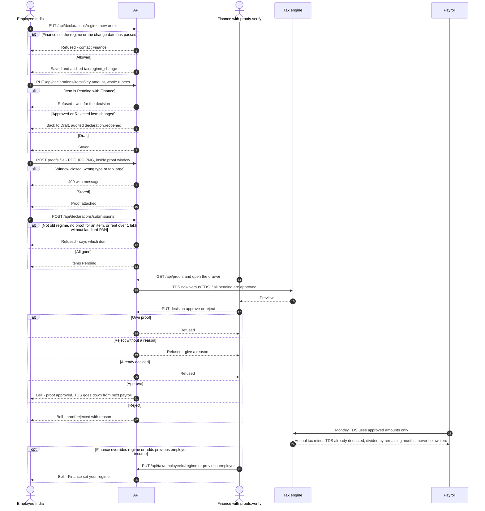
```mermaid
sequenceDiagram
    autonumber
    actor E as Employee India
    participant API as API
    actor F as Finance with proofs.verify
    participant T as Tax engine
    participant P as Payroll

    E->>API: PUT /api/declarations/regime new or old
    alt Finance set the regime or the change date has passed
        API-->>E: Refused - contact Finance
    else Allowed
        API-->>E: Saved and audited tax.regime_change
    end
    E->>API: PUT /api/declarations/items/key amount, whole rupees
    alt Item is Pending with Finance
        API-->>E: Refused - wait for the decision
    else Approved or Rejected item changed
        API-->>E: Back to Draft, audited declaration.reopened
    else Draft
        API-->>E: Saved
    end
    E->>API: POST proofs file - PDF JPG PNG, inside proof window
    alt Window closed, wrong type or too large
        API-->>E: 400 with message
    else Stored
        API-->>E: Proof attached
    end
    E->>API: POST /api/declarations/submissions
    alt Not old regime, no proof for an item, or rent over 1 lakh without landlord PAN
        API-->>E: Refused - says which item
    else All good
        API-->>E: Items Pending
    end
    F->>API: GET /api/proofs and open the drawer
    API->>T: TDS now versus TDS if all pending are approved
    T-->>F: Preview
    F->>API: PUT decision approve or reject
    alt Own proof
        API-->>F: Refused
    else Reject without a reason
        API-->>F: Refused - give a reason
    else Already decided
        API-->>F: Refused
    else Approve
        API-->>E: Bell - proof approved, TDS goes down from next payroll
    else Reject
        API-->>E: Bell - proof rejected with reason
    end
    P->>T: Monthly TDS uses approved amounts only
    T-->>P: Annual tax minus TDS already deducted, divided by remaining months, never below zero
    opt Finance overrides regime or adds previous employer income
        F->>API: PUT /api/tax/employeeId/regime or previous-employer
        API-->>E: Bell - Finance set your regime
    end
```

---

## 11. Company policies, acknowledgement and the gate

What it shows: how HR publishes an immutable version, how every employee is stopped by a 428 until they accept, and the legal record (FR-POL-1 to FR-POL-6).

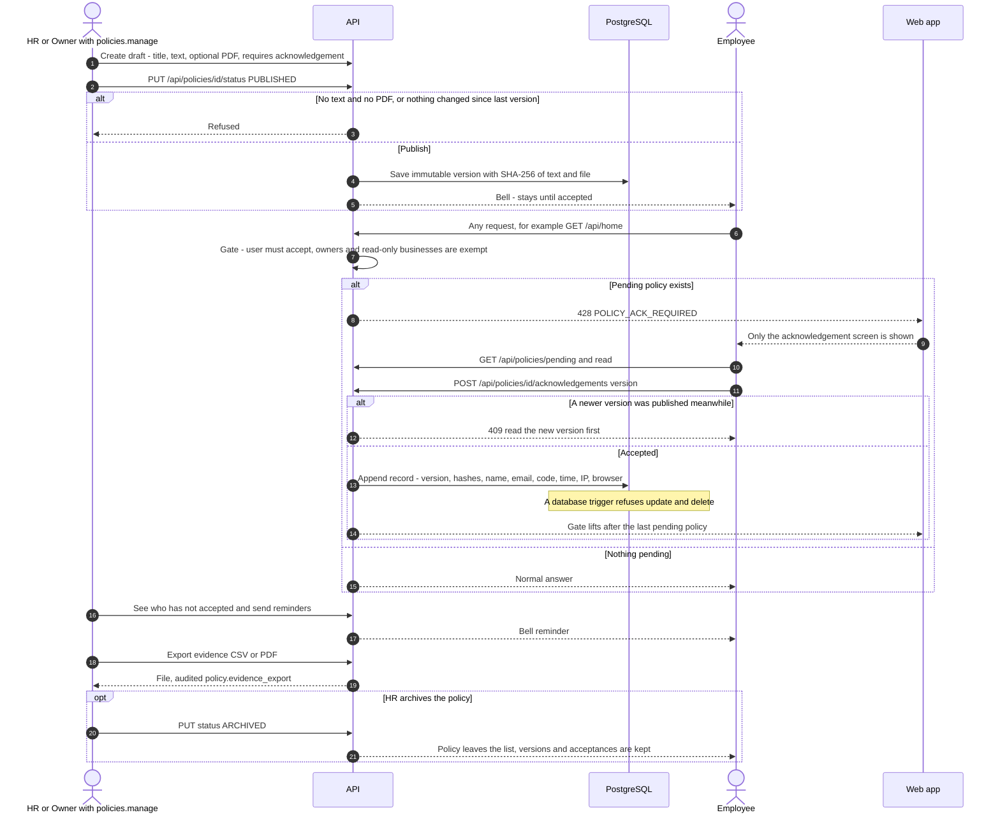
```mermaid
sequenceDiagram
    autonumber
    actor HR as HR or Owner with policies.manage
    participant API as API
    participant DB as PostgreSQL
    actor E as Employee
    participant SPA as Web app

    HR->>API: Create draft - title, text, optional PDF, requires acknowledgement
    HR->>API: PUT /api/policies/id/status PUBLISHED
    alt No text and no PDF, or nothing changed since last version
        API-->>HR: Refused
    else Publish
        API->>DB: Save immutable version with SHA-256 of text and file
        API-->>E: Bell - stays until accepted
    end
    E->>API: Any request, for example GET /api/home
    API->>API: Gate - user must accept, owners and read-only businesses are exempt
    alt Pending policy exists
        API-->>SPA: 428 POLICY_ACK_REQUIRED
        SPA-->>E: Only the acknowledgement screen is shown
        E->>API: GET /api/policies/pending and read
        E->>API: POST /api/policies/id/acknowledgements version
        alt A newer version was published meanwhile
            API-->>E: 409 read the new version first
        else Accepted
            API->>DB: Append record - version, hashes, name, email, code, time, IP, browser
            Note over DB: A database trigger refuses update and delete
            API-->>SPA: Gate lifts after the last pending policy
        end
    else Nothing pending
        API-->>E: Normal answer
    end
    HR->>API: See who has not accepted and send reminders
    API-->>E: Bell reminder
    HR->>API: Export evidence CSV or PDF
    API-->>HR: File, audited policy.evidence_export
    opt HR archives the policy
        HR->>API: PUT status ARCHIVED
        API-->>E: Policy leaves the list, versions and acceptances are kept
    end
```

---

## 12. Announcements, assets and HR letters

### 12.1 Announcements

What it shows: posting, audience and bell (FR-ANN-1).

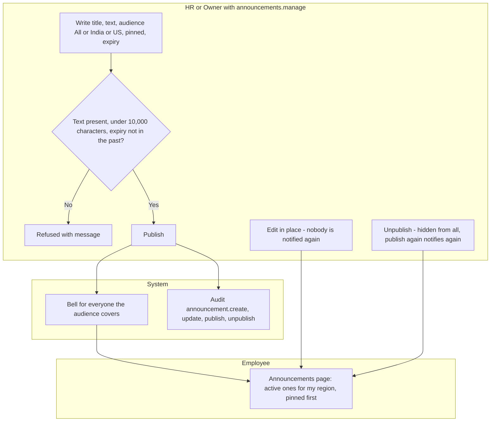
```mermaid
flowchart TD
    subgraph HRO["HR or Owner with announcements.manage"]
        A1["Write title, text, audience All or India or US, pinned, expiry"]
        A2{"Text present, under 10,000 characters, expiry not in the past?"}
        A3["Refused with message"]
        A4["Publish"]
        A5["Edit in place - nobody is notified again"]
        A6["Unpublish - hidden from all, publish again notifies again"]
    end
    subgraph SYS["System"]
        S1["Bell for everyone the audience covers"]
        S2["Audit announcement.create, update, publish, unpublish"]
    end
    subgraph EMP["Employee"]
        E1["Announcements page: active ones for my region, pinned first"]
    end
    A1 --> A2
    A2 -->|No| A3
    A2 -->|Yes| A4 --> S1 --> E1
    A4 --> S2
    A5 --> E1
    A6 --> E1
```

### 12.2 Assets

What it shows: the life of an asset from register to return (FR-AST-1, FR-AST-2).

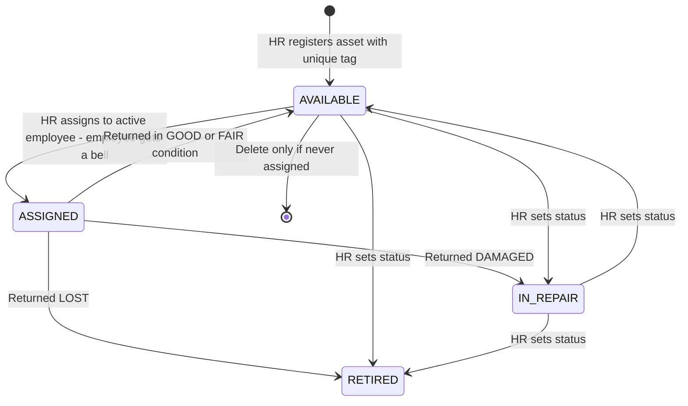
```mermaid
stateDiagram-v2
    [*] --> AVAILABLE: HR registers asset with unique tag
    AVAILABLE --> ASSIGNED: HR assigns to active employee - employee gets a bell
    ASSIGNED --> AVAILABLE: Returned in GOOD or FAIR condition
    ASSIGNED --> IN_REPAIR: Returned DAMAGED
    ASSIGNED --> RETIRED: Returned LOST
    AVAILABLE --> IN_REPAIR: HR sets status
    IN_REPAIR --> AVAILABLE: HR sets status
    AVAILABLE --> RETIRED: HR sets status
    IN_REPAIR --> RETIRED: HR sets status
    AVAILABLE --> [*]: Delete only if never assigned
```

### 12.3 HR letters

What it shows: from template to an immutable issued letter, with the salary-field guard (FR-LET-1, FR-LET-2).

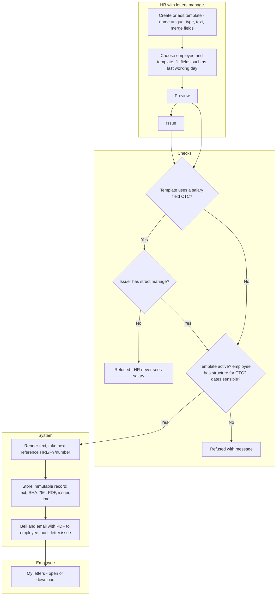
```mermaid
flowchart TD
    subgraph HRL["HR with letters.manage"]
        T1["Create or edit template - name unique, type, text, merge fields"]
        I1["Choose employee and template, fill fields such as last working day"]
        I2["Preview"]
        I3["Issue"]
    end
    subgraph GUARD["Checks"]
        G1{"Template uses a salary field CTC?"}
        G2{"Issuer has struct.manage?"}
        G3["Refused - HR never sees salary"]
        G4{"Template active? employee has structure for CTC? dates sensible?"}
        G5["Refused with message"]
    end
    subgraph SYS["System"]
        S1["Render text, take next reference HRL/FY/number"]
        S2["Store immutable record: text, SHA-256, PDF, issuer, time"]
        S3["Bell and email with PDF to employee, audit letter.issue"]
    end
    subgraph EMP["Employee"]
        E1["My letters - open or download"]
    end
    T1 --> I1 --> I2 --> G1
    I2 --> I3 --> G1
    G1 -->|Yes| G2
    G1 -->|No| G4
    G2 -->|No| G3
    G2 -->|Yes| G4
    G4 -->|No| G5
    G4 -->|Yes| S1 --> S2 --> S3 --> E1
```

---

## 13. Tasks and projects

### 13.1 Create a task, assign and accountable

What it shows: creating a task, who gets which role on it, who is added to the project and who is notified (FR-TASK-1 to FR-TASK-5, FR-TNOT-1).

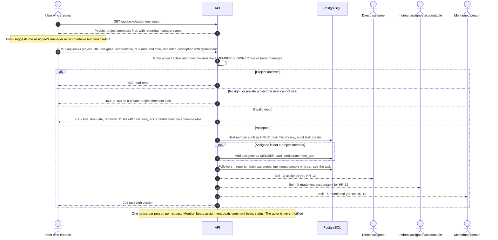
```mermaid
sequenceDiagram
    autonumber
    actor U as User who creates
    participant API as API
    participant DB as PostgreSQL
    actor DA as Direct assignee
    actor IA as Indirect assignee accountable
    actor MN as Mentioned person

    U->>API: GET /api/tasks/assignees search
    API-->>U: People, project members first, with reporting manager name
    Note over U: Form suggests the assignee's manager as accountable but never sets it
    U->>API: POST /api/tasks project, title, assignee, accountable, due date and time, reminder, description with @mentions
    API->>API: Is the project active and does the user have MEMBER or OWNER role or tasks.manage?
    alt Project archived
        API-->>U: 422 read-only
    else No right, or private project the user cannot see
        API-->>U: 403, or 404 so a private project does not leak
    else Invalid input
        API-->>U: 400 - title, due date, reminder 15 60 240 1440 only, accountable must be someone else
    else Accepted
        API->>DB: Next number such as HR-12, task, history row, audit task.create
        opt Assignee is not a project member
            API->>DB: Add assignee as MEMBER, audit project.member_add
        end
        API->>DB: Followers = reporter, both assignees, mentioned people who can see the task
        API-->>DA: Bell - X assigned you HR-12
        API-->>IA: Bell - X made you accountable for HR-12
        API-->>MN: Bell - X mentioned you on HR-12
        API-->>U: 201 task with version
    end
    Note over API: One notice per person per request. Mention beats assignment beats comment beats status. The actor is never notified
```

### 13.2 Status workflow and rights

What it shows: a task moving through the project's steps and who may do it (FR-TASK-4 to FR-TASK-6, FR-PRJ-6).

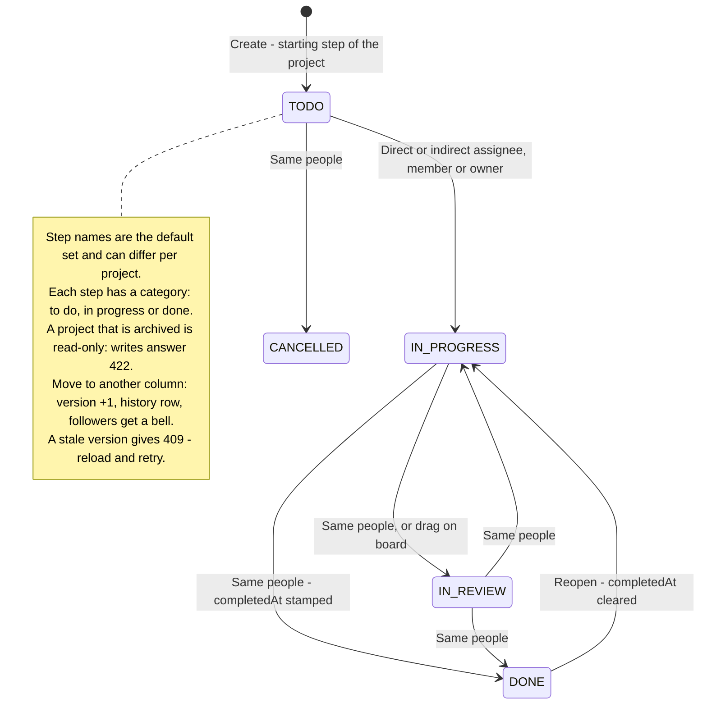
```mermaid
stateDiagram-v2
    [*] --> TODO: Create - starting step of the project
    TODO --> IN_PROGRESS: Direct or indirect assignee, member or owner
    IN_PROGRESS --> IN_REVIEW: Same people, or drag on board
    IN_REVIEW --> IN_PROGRESS: Same people
    IN_PROGRESS --> DONE: Same people - completedAt stamped
    IN_REVIEW --> DONE: Same people
    TODO --> CANCELLED: Same people
    DONE --> IN_PROGRESS: Reopen - completedAt cleared
    note right of TODO
        Step names are the default set and can differ per project.
        Each step has a category: to do, in progress or done.
        A project that is archived is read-only: writes answer 422.
        Move to another column: version +1, history row, followers get a bell.
        A stale version gives 409 - reload and retry.
    end note
```

### 13.3 Comment, mention, follow, attach

What it shows: how a comment reaches the right people without leaking a private task (FR-TASK-8, FR-TASK-9, FR-TNOT-1).

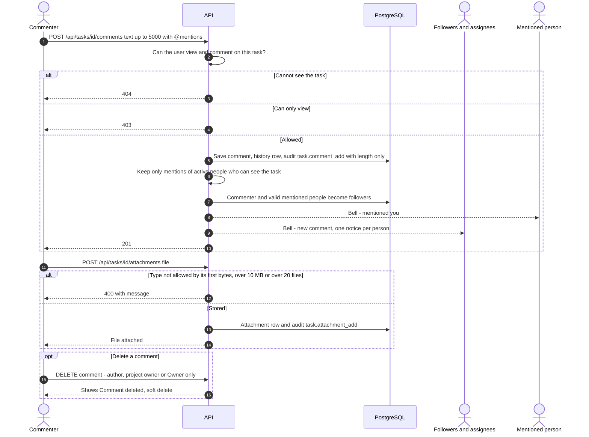
```mermaid
sequenceDiagram
    autonumber
    actor U as Commenter
    participant API as API
    participant DB as PostgreSQL
    actor F as Followers and assignees
    actor MN as Mentioned person

    U->>API: POST /api/tasks/id/comments text up to 5000 with @mentions
    API->>API: Can the user view and comment on this task?
    alt Cannot see the task
        API-->>U: 404
    else Can only view
        API-->>U: 403
    else Allowed
        API->>DB: Save comment, history row, audit task.comment_add with length only
        API->>API: Keep only mentions of active people who can see the task
        API->>DB: Commenter and valid mentioned people become followers
        API-->>MN: Bell - mentioned you
        API-->>F: Bell - new comment, one notice per person
        API-->>U: 201
    end
    U->>API: POST /api/tasks/id/attachments file
    alt Type not allowed by its first bytes, over 10 MB or over 20 files
        API-->>U: 400 with message
    else Stored
        API->>DB: Attachment row and audit task.attachment_add
        API-->>U: File attached
    end
    opt Delete a comment
        U->>API: DELETE comment - author, project owner or Owner only
        API-->>U: Shows Comment deleted, soft delete
    end
```

### 13.4 Due dates, daily reminders and the extra reminder

What it shows: the job that runs every 10 minutes and decides which bell reminders to send, including the optional extra reminder before the due moment (FR-TASK-7, FR-TNOT-2, FR-TNOT-3).

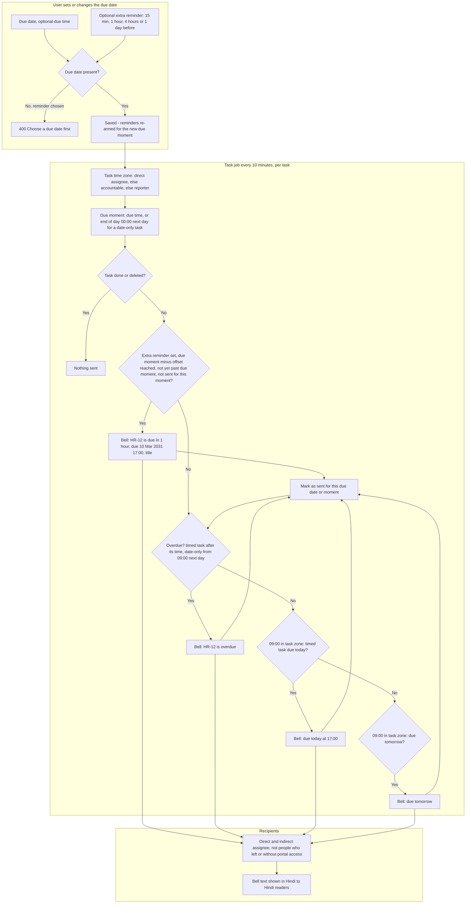
```mermaid
flowchart TD
    subgraph SET["User sets or changes the due date"]
        U1["Due date, optional due time"]
        U2["Optional extra reminder: 15 min, 1 hour, 4 hours or 1 day before"]
        U3{"Due date present?"}
        U4["400 Choose a due date first"]
        U5["Saved - reminders re-armed for the new due moment"]
    end
    subgraph JOB["Task job every 10 minutes, per task"]
        J1["Task time zone: direct assignee, else accountable, else reporter"]
        J2["Due moment: due time, or end of day 00:00 next day for a date-only task"]
        J3{"Task done or deleted?"}
        J4["Nothing sent"]
        J5{"Extra reminder set, due moment minus offset reached, not yet past due moment, not sent for this moment?"}
        J6["Bell: HR-12 is due in 1 hour, due 10 Mar 2031 17:00, title"]
        J7{"Overdue? timed task after its time, date-only from 09:00 next day"}
        J8["Bell: HR-12 is overdue"]
        J9{"09:00 in task zone: timed task due today?"}
        J10["Bell: due today at 17:00"]
        J11{"09:00 in task zone: due tomorrow?"}
        J12["Bell: due tomorrow"]
        J13["Mark as sent for this due date or moment"]
    end
    subgraph WHO["Recipients"]
        W1["Direct and indirect assignee, not people who left or without portal access"]
        W2["Bell text shown in Hindi to Hindi readers"]
    end
    U1 --> U3
    U2 --> U3
    U3 -->|No, reminder chosen| U4
    U3 -->|Yes| U5
    U5 --> J1 --> J2 --> J3
    J3 -->|Yes| J4
    J3 -->|No| J5
    J5 -->|Yes| J6 --> J13
    J5 -->|No| J7
    J13 --> J7
    J7 -->|Yes| J8 --> J13
    J7 -->|No| J9
    J9 -->|Yes| J10 --> J13
    J9 -->|No| J11
    J11 -->|Yes| J12 --> J13
    J6 --> W1
    J8 --> W1
    J10 --> W1
    J12 --> W1
    W1 --> W2
```

### 13.5 Project access: who sees what

What it shows: the decision the API takes before it shows a project or task, including the Owner exception and the audit row (FR-PRJ-1 to FR-PRJ-5).

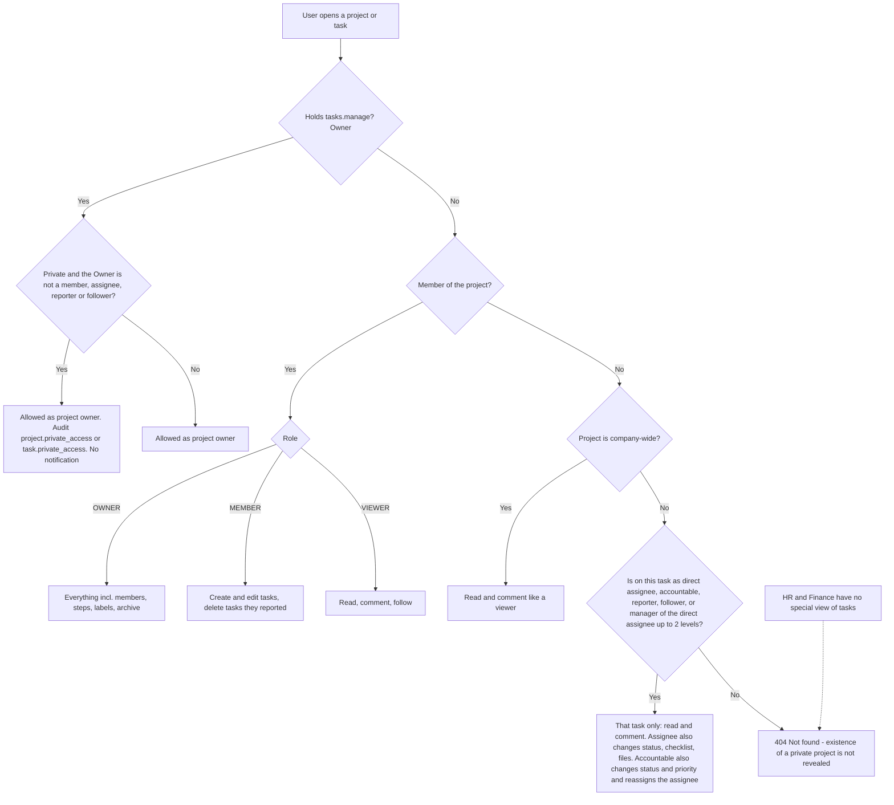
```mermaid
flowchart TD
    Q["User opens a project or task"] --> A{"Holds tasks.manage? Owner"}
    A -->|Yes| A1{"Private and the Owner is not a member, assignee, reporter or follower?"}
    A1 -->|Yes| A2["Allowed as project owner. Audit project.private_access or task.private_access. No notification"]
    A1 -->|No| A3["Allowed as project owner"]
    A -->|No| B{"Member of the project?"}
    B -->|Yes| B1{"Role"}
    B1 -->|OWNER| B2["Everything incl. members, steps, labels, archive"]
    B1 -->|MEMBER| B3["Create and edit tasks, delete tasks they reported"]
    B1 -->|VIEWER| B4["Read, comment, follow"]
    B -->|No| C{"Project is company-wide?"}
    C -->|Yes| C1["Read and comment like a viewer"]
    C -->|No| D{"Is on this task as direct assignee, accountable, reporter, follower, or manager of the direct assignee up to 2 levels?"}
    D -->|Yes| D1["That task only: read and comment. Assignee also changes status, checklist, files. Accountable also changes status and priority and reassigns the assignee"]
    D -->|No| E["404 Not found - existence of a private project is not revealed"]
    HRF["HR and Finance have no special view of tasks"] -.-> E
```

---

## 14. Subscription expiry and read-only mode

What it shows: how a business moves between subscription states and what each state allows (FR-SUB-1 to FR-SUB-8).

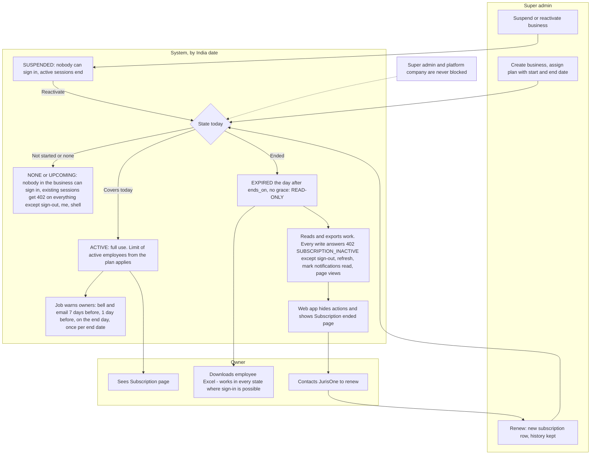
```mermaid
flowchart TD
    subgraph SA["Super admin"]
        S1["Create business, assign plan with start and end date"]
        S2["Renew: new subscription row, history kept"]
        S3["Suspend or reactivate business"]
    end
    subgraph SYS["System, by India date"]
        D1{"State today"}
        N1["NONE or UPCOMING: nobody in the business can sign in, existing sessions get 402 on everything except sign-out, me, shell"]
        A1["ACTIVE: full use. Limit of active employees from the plan applies"]
        W1["Job warns owners: bell and email 7 days before, 1 day before, on the end day, once per end date"]
        X1["EXPIRED the day after ends_on, no grace: READ-ONLY"]
        X2["Reads and exports work. Every write answers 402 SUBSCRIPTION_INACTIVE except sign-out, refresh, mark notifications read, page views"]
        X3["Web app hides actions and shows Subscription ended page"]
        SU["SUSPENDED: nobody can sign in, active sessions end"]
    end
    subgraph OWN["Owner"]
        O1["Sees Subscription page"]
        O2["Downloads employee Excel - works in every state where sign-in is possible"]
        O3["Contacts JurisOne to renew"]
    end
    S1 --> D1
    D1 -->|Not started or none| N1
    D1 -->|Covers today| A1 --> W1
    D1 -->|Ended| X1 --> X2 --> X3 --> O3
    A1 --> O1
    X1 --> O2
    O3 --> S2 --> D1
    S3 --> SU
    SU -->|Reactivate| D1
    SUPER["Super admin and platform company are never blocked"] -.-> D1
```

---

## 15. Audit write path

What it shows: how every write request and sensitive read is recorded even when it is refused or fails, plus the business events written by services (FR-AUD-1 to FR-AUD-5).

```mermaid
sequenceDiagram
    autonumber
    participant B as Browser SPA
    participant F as Audit filter - outermost
    participant S as Security and gates
    participant C as Controller and service
    participant DB as PostgreSQL main connection
    participant AU as PostgreSQL audit connection
    actor O as Owner or super admin

    B->>F: Any write request or sensitive read, new X-Request-Id
    F->>S: Pass on
    alt Not signed in 401, blocked origin, subscription 402, policy 428, no permission 403
        S-->>F: Refusal
    else Passed
        S->>C: Run business rule
        C->>DB: Change data in a transaction
        C->>DB: Business audit entry - who, what, before and after
        alt Rule refused 422 or error 500
            C-->>F: Error, transaction rolled back
        else Success
            C-->>F: 200 or 201
        end
    end
    F->>AU: finally - one row on its own connection: actor, business, method, path with secrets masked, status, duration, IP, user agent, request id
    alt Audit write fails
        F->>F: Log ERROR and count jurisone.audit.write.failures - request is not broken
    end
    F-->>B: Response with X-Request-Id
    B->>F: POST /api/audit/page-views on each page open
    Note over AU: Append-only table - a trigger refuses update and delete. No bodies, cookies, codes or tokens are stored
    O->>F: GET /api/audit or /api/platform/audit with filters
    F->>AU: Also recorded as a sensitive read
    AU-->>O: Rows - business log for owner, all businesses for super admin, CSV export
```

---

## 16. Notifications and language

What it shows: how a bell notification is created in English and shown in the reader's language (FR-NOT-1 to FR-NOT-4, FR-LANG-1 to FR-LANG-3).

```mermaid
flowchart TD
    subgraph SRV["API"]
        N1["Event happens: decision, assignment, reminder, policy, payslip, announcement, asset, letter, subscription"]
        N2["Text built in English with the data filled in, stored with a link"]
        N3{"Also an email event? code, leave or regularization decision, payslip, onboarding link, letter, subscription warning"}
        N4["Send email in English"]
    end
    subgraph WEB["Web app"]
        W1["Bell and /notifications and Home card list unread first"]
        W2{"Reader language"}
        W3["Show stored English text"]
        W4["Match the sentence against the Hindi templates, fill names, keys, titles as written, translate enumerations"]
        W5{"A template matches?"}
        W6["Show Hindi sentence"]
        W7["Show English unchanged"]
        W8["Mark one or all as read - allowed even in read-only mode"]
        W9["Policy notices stay until the policy is accepted"]
    end
    N1 --> N2 --> N3
    N3 -->|Yes| N4
    N2 --> W1 --> W2
    W2 -->|English| W3
    W2 -->|Hindi| W4 --> W5
    W5 -->|Yes| W6
    W5 -->|No| W7
    W1 --> W8
    W1 --> W9
```

---

## 17. JurisTrack placeholder

What it shows: what a user sees today for the Juris Track menu entry, and where the planned gateway will attach (FR-JT-1 to FR-JT-3). The full connection flow (token, gateway, roster, roles, audit) is in `FLOW-JurisTrack-JurisOne-Connection.md`.

```mermaid
flowchart TD
    subgraph SA["Super admin"]
        G1["Plan includes module JURIS_TRACK, or grant it directly: complimentary or paid with dates"]
    end
    subgraph WEB["User with self, dir or roles.manage"]
        U1["Opens /juris-track or the menu entry"]
    end
    subgraph API["JurisOne API"]
        A1{"Module active for the business today?"}
        A2["404 Not found - menu entry is not shown either"]
        A3["Page shows Coming soon"]
        A4["Planned: gateway checks session, grant and permission, signs a short-lived single-use token, forwards to JurisTrack, pushes the roster"]
    end
    G1 --> A1
    U1 --> A1
    A1 -->|No| A2
    A1 -->|Yes| A3
    A3 -. "not built yet" .-> A4
```
